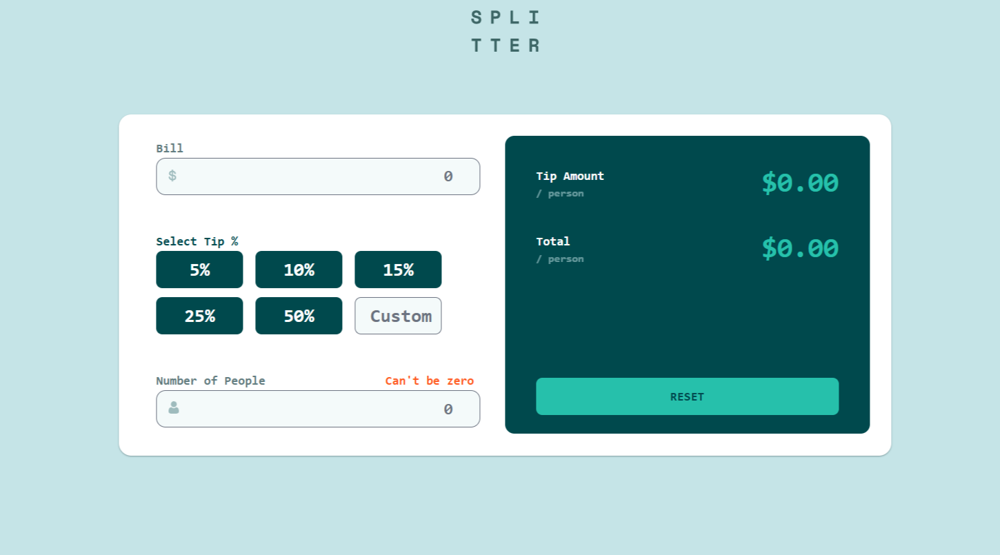

# Tip Calculator in React

**Description:** With the provided assets remake the Tip Calculator in React.

***Here are the requirements that are needed:***
- Made using React and Tailwind CSS
- Desktop and Mobile responsive

**Developer:** Michael Heckerman

**Date Revised:** 3/14/25

## Link(s):

[Github-Repo](https://github.com/mkheck13/tipcalculatorreact)

[Vercel](https://tipcalculatorreact.vercel.app/)

## FeedBack/Peer Review: 

**Reviewer:** (Brock Spacek)

**Comments:** The following project looks pretty similar to the provided details that we were provided. However, I did find a few differences that should be easy fixes. First the hovers and the click on your tip buttons Should be a much darker green while also changing your text cover using a hover effect. Speaking of hovers, your bill input should also have a green hover or click event that works for its active state. You can also get rid of the borders completely on the inputs. The final thing is that your "Custom" Placeholder text is cut off at the end just a bit and harder to read. The functionality all works great. The responsiveness between the medium and large breakpoints is a bit off but I do understand that the project is in 1440px and 375px
